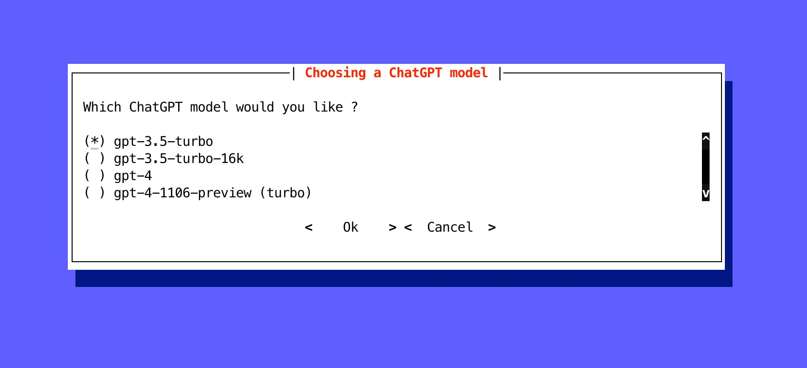

As developers, we spend a significant amount of time in our terminal.
It's only logical to bring the interaction with ChatGPT into our terminal.
Plus, it's a great opportunity to learn how to create powerful interactive CLI applications in Python.
Forget about the standard `input()`, we are going to make it much cooler!

To get started, we need to interact with ChatGPT via API, so we need an API Key (`OPENAI_API_KEY`).
You can read more about how to get access to the ChatGPT API in the [official documentation](https://help.openai.com/en/collections/3675931-openai-api).
We also need two external Python libraries: [Python Prompt Toolkit 3.0](https://python-prompt-toolkit.readthedocs.io/) and [OpenAI Python Library](https://platform.openai.com/docs/api-reference/introduction?lang=python).
Install them in your environment to make sure all the examples below work for you.

### v1. openai api

Let's start with a very simple and naive version of our CLI application:

```python
import os
import openai

# Please remember to export your API key to environment variables.
# $> export OPENAI_API_KEY=...
openai.api_key = os.getenv('OPENAI_API_KEY')
# openai.organization = 'org-...'
openai_model = 'gpt-3.5-turbo'

messages = [
    # system message first, it helps set the behavior of the assistant
    {'role': 'system', 'content': 'You are a helpful assistant.'},
]

while True:
    message = input('Human: ')
    if message:
        messages.append({'role': 'user', 'content': message})
        # https://platform.openai.com/docs/guides/chat/chat-vs-completions
        chat_completion = openai.ChatCompletion.create(
            model=openai_model,
            messages=messages,
            # Temperature: 0.5 to 0.7 for a balance
            # between creativity and coherence.
            temperature=.5,
        )
        content = chat_completion.choices[0].message.content
        print(f'Robot: {content}')
        messages.append({'role': 'assistant', 'content': content})
```

This code is straightforward and works!
You can run it and communicate with ChatGPT.

```text
Human: Hello, how are you doing, robot?
Robot: Hello! I'm doing well, thank you for asking. As an AI assistant, I don't have feelings, but I'm here to help you with any questions or tasks you have. How can I assist you today?
```

However, if you use this script daily, it will soon become annoying.
Why? Because it's terribly inconvenient.
You can't move the cursor, delete something from the middle of a sentence, you don't have multiline input, no history of your input, no "clean" exit from the dialog (Ctrl+C leads to an unhandled `KeyboardInterrupt` exception), etc.

But all these issues can be easily fixed with the powerful and popular [prompt_toolkit](https://github.com/prompt-toolkit/python-prompt-toolkit/) library.
Let's gradually improve our first version of the program.

### v2. prompt_toolkit

By simply replacing the standard Python `input` with the `prompt` from the `prompt_toolkit` library, we gain the ability to move the cursor and correct something in the middle or at the beginning of a sentence, i.e., edit our prompt in a very familiar manner.

```python
import os
import openai

from prompt_toolkit import prompt

openai.api_key = os.getenv('OPENAI_API_KEY')
# openai.organization = 'org-...'
openai_model = 'gpt-3.5-turbo'

messages = [
    {'role': 'system', 'content': 'You are a helpful assistant.'},
]

while True:
    message = prompt('Human: ')  # only one change
    if message:
        messages.append({'role': 'user', 'content': message})
        chat_completion = openai.ChatCompletion.create(
            model=openai_model,
            messages=messages,
            temperature=.5,
        )
        content = chat_completion.choices[0].message.content
        print(f'Robot: {content}')
        messages.append({'role': 'assistant', 'content': content})
```

This is already a good result, but it's just the beginning.

### v3. multiline input

The `prompt` function accepts several dozen different parameters that add various cool features for input in our program.
Let's activate some parameters of the `prompt` function to add a bit of color to our application, change the cursor view, and... add a multiline input mode!

Sometimes our request to ChatGPT may contain not one, but many lines.
Therefore, multiline input will be very convenient.
However, keep in mind that the `Enter` key will now insert a newline instead of accepting and returning the input.
The user will now have to press `Meta+Enter` to accept the input.
Or `Escape` followed by `Enter`.

```python
import os
import openai

from prompt_toolkit import prompt
from prompt_toolkit.cursor_shapes import CursorShape
from prompt_toolkit import print_formatted_text, HTML

openai.api_key = os.getenv('OPENAI_API_KEY')
# openai.organization = 'org-...'
openai_model = 'gpt-3.5-turbo'

messages = [
    {'role': 'system', 'content': 'You are a helpful assistant.'},
]

reply_template = '<style fg="ansiwhite" bg="ansigreen"> Robot:</style> %s'

def get_prompt():
    return [
        ('bg:cornsilk fg:maroon', ' Human:'),
        ('', ' '),
    ]

while True:
    message = prompt(get_prompt, cursor=CursorShape.BLOCK, multiline=True)
    if message:
        messages.append({'role': 'user', 'content': message})
        chat_completion = openai.ChatCompletion.create(
            model=openai_model,
            messages=messages,
            temperature=.5,
        )
        content = chat_completion.choices[0].message.content
        print_formatted_text(HTML(reply_template % content))
        messages.append({'role': 'assistant', 'content': content})
```

Let's test the multiline input mode with an example.
Let's ask ChatGPT a multiline question:

```text
Human: Hello, Robot! Can you fix the code example below?

       print('multiline mode")  # it's Python

Robot: Certainly! It looks like there's a small error in the code. The closing quotation mark for the string is incorrect. Here's the corrected code:

print('multiline mode')  # it's Python

Now the code should work properly and print 'multiline mode'.
```

### v4. history

We're used to our shell "remembering" the history of our commands, which can be stored in `.bash_history` file, for example.
Also, our shells can make suggestions, which can be predefined or taken from our command history.
We could also use this functionality when communicating with ChatGPT in the terminal.
Plus, it's not difficult to enable these features in `prompt_toolkit`.

In the example below, we'll already have a history of our requests to ChatGPT.
And this history will be stored between runs of our application in the `.prompt_history` file.

Based on this history, suggestions will be formed, which can be activated by pressing the "right arrow" key (➡️).

Another difference from previous versions: the `PromptSession` class will be used.

```python
import os
import openai

from prompt_toolkit import PromptSession
from prompt_toolkit.history import FileHistory
from prompt_toolkit.auto_suggest import AutoSuggestFromHistory
from prompt_toolkit.cursor_shapes import CursorShape
from prompt_toolkit import print_formatted_text, HTML

openai.api_key = os.getenv('OPENAI_API_KEY')
# openai.organization = 'org-...'
openai_model = 'gpt-3.5-turbo'

messages = [
    {'role': 'system', 'content': 'You are a helpful assistant.'},
]

reply_template = '<style fg="ansiwhite" bg="ansigreen"> Robot:</style> %s'

def get_prompt():
    return [
        ('bg:cornsilk fg:maroon', ' Human:'),
        ('', ' '),
    ]

prompt_history = FileHistory('.prompt_history')
session = PromptSession(history=prompt_history)

while True:
    message = session.prompt(
        get_prompt,
        cursor=CursorShape.BLOCK,
        auto_suggest=AutoSuggestFromHistory(),
        multiline=True,
    )

    if message:
        messages.append({'role': 'user', 'content': message})
        chat_completion = openai.ChatCompletion.create(
            model=openai_model,
            messages=messages,
            temperature=.5,
        )
        content = chat_completion.choices[0].message.content
        print_formatted_text(HTML(reply_template % content))
        messages.append({'role': 'assistant', 'content': content})
```

Test this version of the script: it's not much larger than the first one, but it makes the user's input much more convenient.

### v5. dialog

In our program, there's a very important global setting - the ChatGPT model we use (`openai_model`).
It would be convenient to choose a specific ChatGPT model at the time of script launch.
Let's implement this feature by adding a full-screen dialog to select the ChatGPT model.

```python
import os
import openai

from prompt_toolkit import PromptSession
from prompt_toolkit.history import FileHistory
from prompt_toolkit.auto_suggest import AutoSuggestFromHistory
from prompt_toolkit.cursor_shapes import CursorShape
from prompt_toolkit import print_formatted_text, HTML
from prompt_toolkit.shortcuts import radiolist_dialog

openai.api_key = os.getenv('OPENAI_API_KEY')
# openai.organization = 'org-...'

messages = [
    {'role': 'system', 'content': 'You are a helpful assistant.'},
]

reply_template = '<style fg="ansiwhite" bg="ansigreen"> Robot:</style> %s'

def get_prompt():
    return [
        ('bg:cornsilk fg:maroon', ' Human:'),
        ('', ' '),
    ]

prompt_history = FileHistory('.prompt_history')
session = PromptSession(history=prompt_history)

openai_model = radiolist_dialog(
    title='Choosing a ChatGPT model',
    text='Which ChatGPT model would you like ?',
    values=[
        ('gpt-3.5-turbo', 'gpt-3.5-turbo'),
        ('gpt-3.5-turbo-16k', 'gpt-3.5-turbo-16k'),
        ('gpt-4', 'gpt-4')
    ]
).run()

while openai_model:
    message = session.prompt(
        get_prompt,
        cursor=CursorShape.BLOCK,
        auto_suggest=AutoSuggestFromHistory(),
        multiline=True,
    )

    if message:
        messages.append({'role': 'user', 'content': message})
        chat_completion = openai.ChatCompletion.create(
            model=openai_model,
            messages=messages,
            temperature=.5,
        )
        content = chat_completion.choices[0].message.content
        print_formatted_text(HTML(reply_template % content))
        messages.append({'role': 'assistant', 'content': content})
```

Running this version of the script, you'll see something like this:



### v6. graceful stop

It's time to add a graceful stop to our program, for example, exit by Ctrl+C.
Also, let's rewrite our entire script in an asynchronous style.
This version of the script can already be used on a daily basis without any discomfort 😊

```python
import asyncio
import os
import openai

from prompt_toolkit import PromptSession
from prompt_toolkit.history import FileHistory
from prompt_toolkit.auto_suggest import AutoSuggestFromHistory
from prompt_toolkit.cursor_shapes import CursorShape
from prompt_toolkit import print_formatted_text, HTML
from prompt_toolkit.shortcuts import radiolist_dialog
from prompt_toolkit.patch_stdout import patch_stdout

openai.api_key = os.getenv('OPENAI_API_KEY')
# openai.organization = 'org-...'

def get_prompt():
    return [
        ('bg:cornsilk fg:maroon', ' Human:'),
        ('', ' '),
    ]


def choose_openai_model() -> str:
    return radiolist_dialog(
        title='Choosing a ChatGPT model',
        text='Which ChatGPT model would you like ?',
        values=[
            ('gpt-3.5-turbo', 'gpt-3.5-turbo'),
            ('gpt-3.5-turbo-16k', 'gpt-3.5-turbo-16k'),
            ('gpt-4', 'gpt-4')
        ]
    ).run()


async def main(openai_model: str):
    messages = [
        {'role': 'system', 'content': 'You are a helpful assistant.'},
    ]

    name = HTML('<style fg="ansiwhite" bg="ansigreen"> Robot:</style> ')

    prompt_history = FileHistory('.prompt_history')
    session = PromptSession(history=prompt_history)

    with patch_stdout():
        while True:
            message = await session.prompt_async(
                get_prompt,
                cursor=CursorShape.BLOCK,
                auto_suggest=AutoSuggestFromHistory(),
                multiline=True,
            )

            if message:
                messages.append({'role': 'user', 'content': message})
                print_formatted_text(name)
                chat_completion = await openai.ChatCompletion.acreate(
                    model=openai_model,
                    messages=messages,
                    temperature=.5,
                    stream=True,  # the streaming mode
                )

                reply = ''
                async for chunk in chat_completion:
                    content = chunk['choices'][0]['delta'].get('content', '')
                    print_formatted_text(content, end='')
                    reply += content

                print_formatted_text('')
                messages.append({'role': 'assistant', 'content': reply})


if __name__ == '__main__':
    try:
        model = choose_openai_model()
        if model:
            asyncio.run(main(model))
    except KeyboardInterrupt:
        print_formatted_text('GoodBye!')
```

Now, running the script, you can press Ctrl+C at any time, and the program execution will be terminated.
At the same time, you won't see any unpleasant messages about unhandled exceptions.
The program ends correctly.

Moreover, the streaming mode for receiving a response from ChatGPT has been enabled.
In other words, once a part of the response from ChatGPT is received, it is immediately displayed on the screen.
In this form, waiting for a response from ChatGPT is a bit more fun, especially in those cases where the response from ChatGPT is really large and takes several seconds to fully form.

### v7. ...
You can continue to develop our CLI application further.
For this, the `prompt_toolkit` package has a lot more interesting things.
But the examples provided are enough for the article.
Explore and use the rest on your own!
